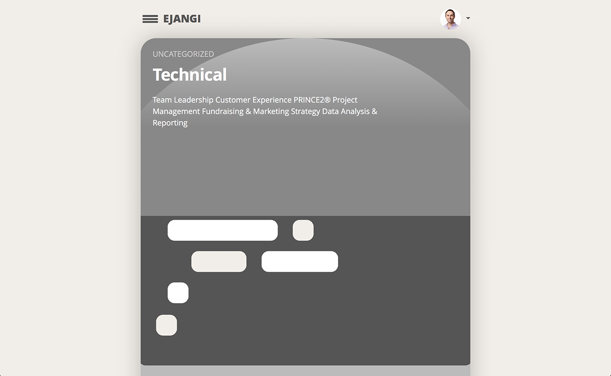

# ejangi.com

Wordpress Theme for ejangi.com




## Development

1) Create your own *mariadb_root_password* file:

```
touch mariadb_root_password
```

2) Install [Docker](https://www.docker.com/products/docker-desktop), build the image and run the container:

```
docker-compose build
docker-compose up
```

3) Open a browser and navigate to [http://localhost:8081](http://localhost:8081). Follow the Wordpress installation wizard to get setup.